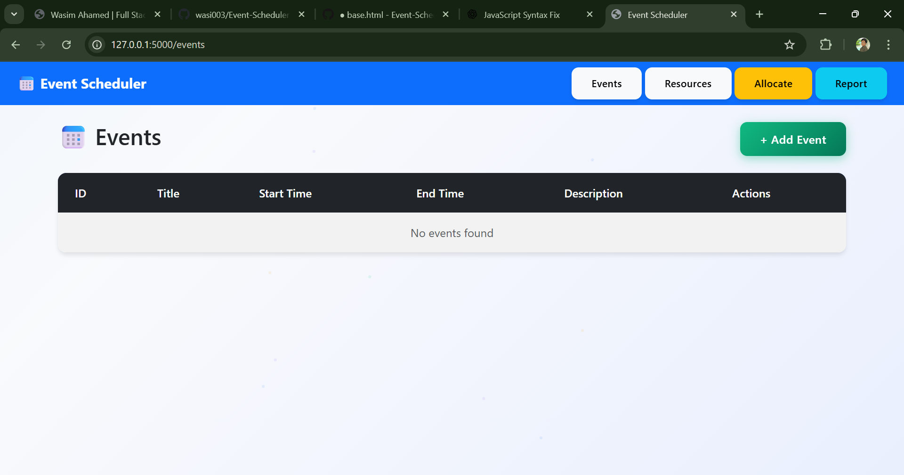
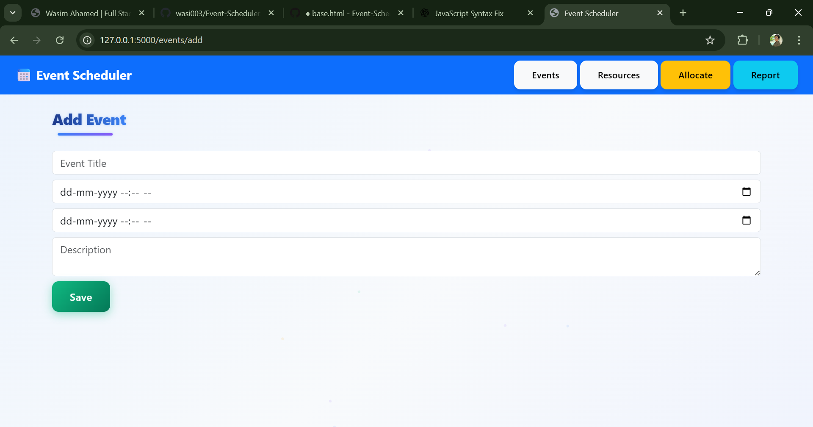
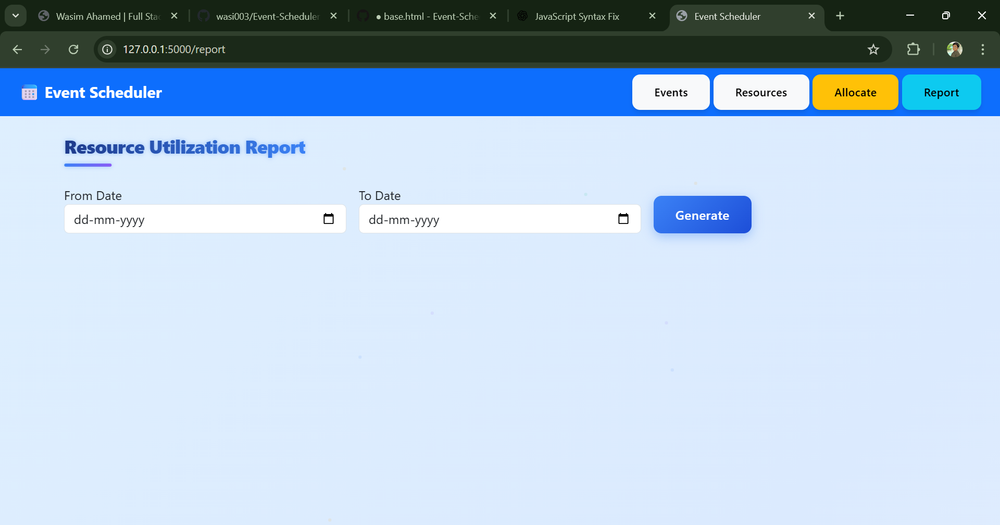

```markdown
# 📅 Event Scheduler – Flask Web Application

## 📖 Project Description
The **Event Scheduler** is a Flask-based web application designed to manage events and resources efficiently.  
It enables users and administrators to create, view, update, and delete events, assign resources to events, and manage schedules using a centralized database.

The application is built using Flask with SQLAlchemy ORM and SQLite for data persistence. It follows a modular structure with separate routes, models, and configuration files to ensure maintainability and scalability.

---

## 🛠️ Tech Stack
- **Backend:** Python (Flask)
- **Frontend:** HTML, CSS, Jinja2 Templates
- **Database:** SQLite
- **ORM:** SQLAlchemy
- **Environment:** Python Virtual Environment

---

## 🚀 Features Implemented
- User authentication (login & logout)
- Event creation, editing, and deletion
- Resource management
- Allocation of resources to events
- Admin and user role handling
- SQLite database integration
- Flash messages for user interaction
- Modular Flask route structure

---

## 📂 Project Structure
```

New folder/
│── app.py
│── config.py
│── models.py
│── clear_db.py
│── remove_users.py
│── requirements.txt
│── events.db
│── instance/
│   └── events.db
│── routes/
│   ├── events.py
│   └── resources.py
│── templates/
│── static/
│── README.md

````

---

## ⚙️ Installation Instructions

### 1️⃣ Clone the Repository
```bash
git clone <repository-url>
cd New\ folder
````

---

### 2️⃣ Create and Activate Virtual Environment

#### Windows

```bash
python -m venv venv
venv\Scripts\activate
```

#### macOS / Linux

```bash
python3 -m venv venv
source venv/bin/activate
```

---

### 3️⃣ Install Required Dependencies

```bash
pip install -r requirements.txt
```

---

### 4️⃣ Database Setup

This project uses **SQLite**, so no external database server is required.

To initialize or reset the database:

```bash
python clear_db.py
```

Database file used:

```
events.db
```

---

## ▶️ How to Run the Application

```bash
python app.py
```

Then open your browser and visit:

```
http://127.0.0.1:5000/
```

---

## 🗄️ Database Schema Diagram

```
                       +------------------+        +--------------+
                       |      Event       |        |   Resource   |
                       +------------------+        +--------------+
                    +->| id (PK)          |        | id (PK)      |
                    |  | title            |        | name         |
                    |  | date             |        | type         |
                    |  | created_by (FK)  |        | availability |
                    |  +------------------+        +--------------+
                    |
                    |  +----------------------------------------+
                    +--| EventResourceAllocation                |
                       +----------------------------------------+
                       | id (PK)                                |
                       | event_id (FK)                          |
                       | resource_id (FK)                       |
                       +----------------------------------------+
```

---

## 🖼️ Screenshots of Major Screens

### 🏠 Dashboard



### 📆 Create Event



### 🧰 Resource Management



### 📋 Event List


---

## 🎥 Screen-Recorded Demo Video 

👉 **Demo Video Link:**
[[Demo video link will be updated here](https://drive.google.com/file/d/1ltUlwVerHNbs8GtZ_XVOp-6ghlXtF7XU/view?usp=sharing)]

The demo video demonstrates:

* Application startup
* Event creation and management
* Resource allocation
* Database interaction

---

## 🧹 Utility Scripts

* `clear_db.py` – Clears all database tables
* `remove_users.py` – Removes existing users from the database

---

## 📌 Future Enhancements

* Role-based access control
* REST API support
* Email notifications
* Calendar integration
* Cloud deployment

---

## 👨‍💻 Author

**Name:** Wasim Ahamed
**Project Type:** Academic / Learning Project
**Framework:** Flask

---

## 📜 License

This project is developed for educational purposes only.

```
